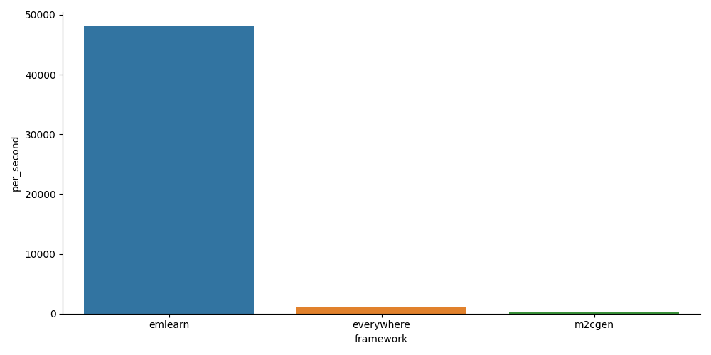

[](https://zenodo.org/badge/latestdoi/670384512)

# emlearn-micropython

[Micropython](https://micropython.org) integration for the [emlearn](https://emlearn.org) Machine Learning library for microcontrollers.

It enables MicroPython applications to run efficient Machine Learning models on microcontroller,
without having to touch any C code.

> scikit-learn for Microcontrollers

This is a [TinyML](https://www.tinyml.org/) library,
particularly well suited for low-compexity and low-power classification tasks.
It can be combined with feature preprocessing, including neural networks to address more complex tasks.

## Status
**Minimally useful, on some MicroPython ports**

- Tested *working* on `x64` (Unix port) and `armv7emsp` (Cortex M4F/M7 / STM32).
- **Not working** on `armv6m` (Cortex M0 / RP2040). [Issue](https://github.com/emlearn/emlearn-micropython/issues/14)
- **Not working** on `xtensawin` (ESP32). [Issue](https://github.com/emlearn/emlearn-micropython/issues/12)

## Features

- Classification with [RandomForest](https://en.wikipedia.org/wiki/Random_forest)/DecisionTree models
- Classification and on-device learning with [K-Nearest Neighbors (KNN)](https://en.wikipedia.org/wiki/K-nearest_neighbors_algorithm)
- Classification with Convolutional Neural Network (CNN), using [TinyMaix](https://github.com/sipeed/TinyMaix/) library.
- Fast Fourier Transform (FFT) for feature preprocessing, or general DSP
- Infinite Impulse Response (IIR) filters for feature preprocessing, or general DSP
- Clustering using K-means
- Scaling and data type transformations for `array`, using `emlearn_arrayutils`.
- Load/save Numpy .npy files using [micropython-npyfile](https://github.com/jonnor/micropython-npyfile/)
- Installable as a MicroPython native module. No rebuild/flashing needed
- Operates on standard `array.array` data structures
- Models can be loaded at runtime from a file in disk/flash
- Highly efficient. Inference times down to 100 microseconds, RAM usage <2 kB, FLASH usage <2 kB
- Pre-built binaries available for most architectures.

## Examples

- [xor_trees](./examples/xor_trees/). A "Hello World", using RandomForest.
- [mnist_cnn](./examples/mnist_cnn/). Basic image classification, using Convolutional Neural Network.
- [har_trees](./examples/har_trees/). Accelerometer-based Human Activity Recognition, using Random Forest
- [soundlevel_iir](./examples/soundlevel_iir/). Sound Level Meter, using Infinite Impulse Response (IIR) filters.

## Prerequisites

Minimally you will need

- Python 3.10+ on host
- MicroPython 1.23+ running onto your device

#### Download repository

Download the repository with examples etc
```
git clone https://github.com/emlearn/emlearn-micropython
```

## Usage

Start with the instructions in [XOR example](./examples/xor_trees/).


#### Find architecture and .mpy version

The correct .mpy files to use depend on the CPU architecture of your microcontroller,
as well as the MicroPython version.

| MicroPython version | .mpy version  |
|---------------------| ------------- |
| 1.23.x              | 6.3           |


Identify which CPU architecture your device uses.
You need to specify `ARCH` to install the correct module version.

| ARCH          | Description                       | Examples              |
|---------------|-----------------------------------|---------------------- |
| x64           | x86 64 bit                        | PC                    |
| x86           | x86 32 bit                        |                       |
| armv6m        | ARM Thumb (1)                     | Cortex-M0             |
| armv7m        | ARM Thumb 2                       | Cortex-M3             |
| armv7emsp     | ARM Thumb 2, single float         | Cortex-M4F, Cortex-M7 |
| armv7emdp     | ARM Thumb 2, double floats        | Cortex-M7             |
| xtensa        | non-windowed                      | ESP8266               |
| xtensawin     | windowed with window size 8       | ESP32                 |

Information is also available in the official documentation:
[MicroPython: .mpy files](https://docs.micropython.org/en/latest/reference/mpyfiles.html#versioning-and-compatibility-of-mpy-files)


## Benchmarks

#### UCI handwriting digits

UCI ML hand-written digits datasets dataset from
[sklearn.datasets.load_digits](https://scikit-learn.org/stable/modules/generated/sklearn.datasets.load_digits.html).
8x8 image, 64 features. Values are 4-bit integers (16 levels). 10 classes.

Running with a very simple RandomForest, 7 trees.
Reaches approx 86% accuracy.
Tested on Raspberry PI Pico, with RP2040 microcontroller (ARM Cortex M0 @ 133 MHz).



NOTE: over half of the time for emlearn case,
is spent on converting the Python lists of integers into a float array.
Removing that bottleneck would speed up things considerably.


## Developing locally

#### Prerequisites
These come in addition to the prequisites described above.

Make sure you have the dependencies needed to build for your platform.
See [MicroPython: Building native modules](https://docs.micropython.org/en/latest/develop/natmod.html).

We assume that micropython is installed in the same place as this repository.
If using another location, adjust `MPY_DIR` accordingly.

You should be using the latest MicroPython 1.23 (or newer).

#### Build

Build the .mpy native module
```
make dist ARCH=armv6m MPY_DIR=../micropython
```

Install it on device
```
mpremote cp dist/armv6m*/emlearn_trees.mpy :emlearn_trees.mpy
```

#### Run tests

To build and run tests on host
```
make check
```

## Citations

If you use `emlearn-micropython` in an academic work, please reference it using:

```tex
@misc{emlearn_micropython,
  author       = {Jon Nordby},
  title        = {{emlearn-micropython: Efficient Machine Learning engine for MicroPython}},
  month        = aug,
  year         = 2023,
  doi          = {10.5281/zenodo.8212731},
  url          = {https://doi.org/10.5281/zenodo.8212731}
}
```

