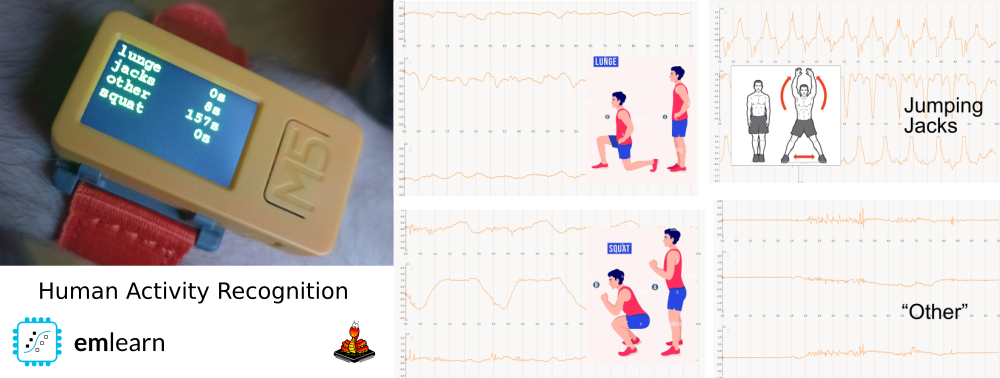
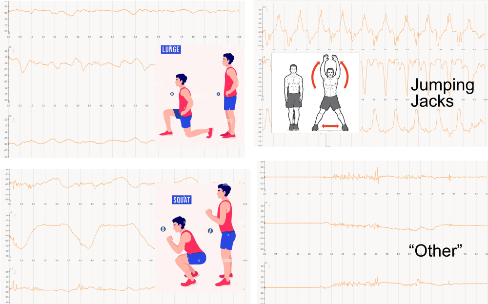

# Human Activity Recognition with tree-based models



*Human Activity Recognition* (HAR) is the task of detecting what activities a human is performing based on motion.
This type of activity recognition is using an Inertial Measurement Unit (IMU) carried on the person.
The IMU consists has at least one accelerometer, gyro or magnetometer - or a combination of these.
It can be a smartphone, smartwatch, fitness tracker, or more specialized device.
The activities can for example be general daily activities, domestic activities, excercises, et.c.

The same kind of approach can also be applied to animals (*Animal Activity Recognition*),
which enables tracking of pets, lifestock and wild animals.
This has been used for many kinds of animals - such as cats, dogs, diary cattle.

The same approach can be used for simple gesture recognition, at least for repetitive gestures.

## Status
Working. Tested running on ESP32 with MicroPython 1.24.

**NOTE:** This is primarily *example* code for a Human Activity Recognition,
not a generally-useful pretrained model.
The dataset used is rather simple, and may not reflect the data you get from your device.
Such data mismatch will often lead to poor classification results.
For a real world usage you should aim to replace the dataset with your own data, collected on your own device.
Or alternatively use a large and diverse dataset from a multiple users, devices and scenarios.

At the bottom on the README there are some instructions and tools for collecting your own data,
and training a custom model on such a dataset.

## Machine Learning pipeline

This example uses an approach based on the paper
[Are Microcontrollers Ready for Deep Learning-Based Human Activity Recognition?](https://www.mdpi.com/2079-9292/10/21/2640).
For each time-window, time-based statistical features are computed,
and then classified with a RandomForest model.

## Dataset 1: Common activities (UCI HAR)

The example uses the [UCI-HAR dataset](https://www.archive.ics.uci.edu/dataset/341/smartphone+based+recognition+of+human+activities+and+postural+transitions).
The classes are by default limited to the three static postures (standing, sitting, lying) plus three dynamic activities (walking, walking downstairs, walking upstairs).
The data is from a waist-mounted smartphone.
Samplerate is 50Hz.
By default only the accelerometer data is used (not the gyro).


## Dataset 2: Excercise detection (custom)

This dataset was collected using the data recording tools described further below.
The data contains 3 kinds of exercises, plus "other" non-exercise activity.
The classes are: Jumping Jacks, Squats, Lunges, Other.
The data was collected using an M5Stick C PLUS 2, mounted on the wrist like a watch (button facing forward).




## Running on host

To run the example on your PC using Unix port of MicroPython.

Make sure to have the Unix port of MicroPython setup.
On Windows you can use Windows Subsystem for Linux (WSL), or Docker.

Download the files in this example directory
```
git clone https://github.com/emlearn/emlearn-micropython.git
cd emlearn-micropython/examples/har_trees
```

Install the dependencies
```console
micropython -m mip install https://emlearn.github.io/emlearn-micropython/builds/master/x64_6.3/emlearn_trees.mpy

micropython har_run.py
```

Results should be around 85% accuracy.

## Running on device (Viper IDE)

Make sure to have MicroPython installed on device.

The fastest and easiest to to install on your device is to use Viper IDE.
This will install the library and the example code:
[](https://viper-ide.org/?install=github:emlearn/emlearn-micropython/examples/har_trees)


## Run on device

Make sure to have MicroPython installed on device.

Install the dependencies
```console
mpremote mip install https://emlearn.github.io/emlearn-micropython/builds/master/xtensawin_6.3/emlearn_trees.mpy
mpremote mip install github:jonnor/micropython-npyfile
mpremote mip install github:jonnor/micropython-zipfile
```

Copy example code
```
mpremote cp har_uci_trees.csv har_uci.testdata.npz timebased.py  :
```

Run model evaluation on a test set
```
mpremote run har_run.py
```

Results should be around 85% accuracy.

## Run on device (with live accelerometer data)

Requires a M5StickC PLUS 2.
Using a MPU6886 accelerometer connected via I2C.

Install dependencies. In addition to the above
```
mpremote mip install github:jonnor/micropython-mpu6886
mpremote cp windower.py :
```

Run the classification
```
mpremote har_live.py
```

This will continiously output the results of the classification,
and count the time spent in each class.

```
classify other [0.0, 0.0, 1.0, 0.0] 216 ms

jumpingjack:	6  seconds
lunge:			0  seconds
other:			34 seconds
squat:			0  seconds

ble-advertise mac=10061c172302 data=aa0100050000ff00
```

The device also sends the classifications out as Bluetooth Low Energy advertisements.
See the code for how the data is encoded used.
This cata can be received on a smartphone or computer, for tracking and storage.

## Run training

This will train a new model for the HAR UCI dataset.
You need to have Python (CPython) installed on the PC.

Install requirements
```
pip install -r requirements.txt
```

Download training data (4 GB space)
```
python -m leaf_clustering.data.har.uci
```

Run training process
```
python har_train.py
```

This will output a new model (named `_trees.csv`).
Can then be deployed to device following the steps above.

## Recording motion data for custom tasks

To learn a classifier for your own custom tasks, you will need to: 1) record data, 2) label the data, 3) run training with custom data.
This example provides some basic tools to assist with this process.

Recording data. Requires a M5StickC PLUS 2.
Before you do this, make sure to **first run live classification example** (to get the dependencies).

Copy additional dependencies
```
mpremote cp recorder.py :
```


Run the recording program
```
mpremote run har_record.py
```

Alternatively: Copy the program to device.
This way it will run even if there is no USB device connected.
```
mpremote cp har_record.py main.py
mpremote reset
```

To get good timestamps on the recorded files, rembember to set the RTC clock.
```
mpremote rtc --set
```

When the recording program runs, the device should show a screen which allows to select between different classes.
Clicking the big button by the screen allows selecting class.
Holding the big button down allows to start recording.
The red LED will light up while recording.

This allows to coarsely label the classes, which is helpful to sort and annotate them later.
To adjust the classes, make changes to `har_record.py`.

The files are placed in the `data/` folder on the internal FLASH filesystem.

To copy the files over to your computer, for building a dataset, use
```
mkdir ./data/raw/mydata1/
mpremote cp -r :./har_record ./data/raw/mydata1/
```

## Labeling recorded motion data

To label the motion data, we can use [Label Studio](https://labelstud.io/).
You can use their hosted version, or run it in Docker, or install it via `pip`.

There is a ready-made Label Studio task defintion provided, 
in the file `labeling/har_classify_config.xml`.

There is a tool designed to convert the .npy files from the `har_record.py` application
into .csv files understood by Label Studio.

```
python har_data2labelstudio.py
```

When you have started Label Studio, create a new Project, and Import the .CSV files as data.
Then you can label each piece of data.


Then use this tool to combine the sensor data files with the labels.
```
python har_labelstudio2dataset.py
```

This will produce a dataset as a .parquet file, which can be used with `har_train.py`.


## Train model on custom dataset


Add your dataset definition to `dataset_config` in `har_train.py`, with a unique name (example `mydata1`).

Then you can run the training process.

```
python har_train.py --dataset mydata1
```

It should output a new model (named `_trees.csv`).
This model can be deployed to device following the steps above.


